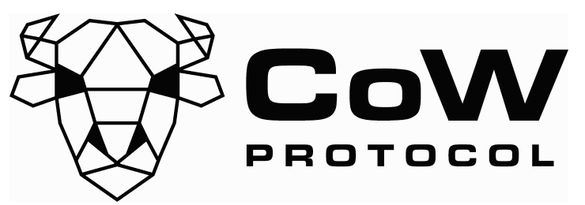

<p align="center">
  
</p>

# CoW SDK

## Test coverage

| Statements                                                                                 | Branches                                                                       | Functions                                                                                | Lines                                                                            |
| ------------------------------------------------------------------------------------------ | ------------------------------------------------------------------------------ | ---------------------------------------------------------------------------------------- | -------------------------------------------------------------------------------- |
|  |  |  |  |

## Getting started

Install the SDK:

```bash
yarn add @cowprotocol/cow-sdk
```

Instantiate the SDK:

```js
import { CowSdk } from '@cowprotocol/cow-sdk'

const chainId = 100 // Gnosis chain
const cowSdk = new CowSdk(chainId)
```

The SDK will expose:

- The CoW API (`cowSdk.cowApi`)
- The CoW Subgraph (`cowSdk.cowSubgraphApi`)
- Convenient method to facilitate signing orders (i.e `cowSdk.signOrder`)

> For a quick snippet with the full process on posting an order see the [Post an Order Example](./docs/post-order-example.ts)

## CoW API

The SDK provides access to the CoW API. The CoW API allows you:

- Post orders
- Get fee quotes
- Get order details
- Get history of orders: i.e. filtering by account, transaction hash, etc.

For example, you can easily get the last 5 order of a trader:

```js
// i.e. Get last 5 orders for a given trader
const trades = await cowSdk.cowApi.getOrders({
  owner: '0x00000000005ef87f8ca7014309ece7260bbcdaeb', // Trader
  limit: 5,
  offset: 0,
})
console.log(trades)
```

The SDK will expose:

- The CoW API (`cowSdk.cowApi`)
- The CoW Subgraph (`cowSdk.cowSubgraphApi`)
- Convenient method to facilitate signing orders (i.e `cowSdk.signOrder`)

> ✨ For a quick snippet with the full process on posting an order see the [Post an Order Example](./docs/post-order-example.ts)

> 📚 Read more about [How to get started with the SDK](https://docs.cow.fi/cow-sdk/getting-started-with-the-sdk)

## Architecture

One way to make the most out of the SDK is to get familiar to its architecture.

> See [SDK Architecture](./docs/architecture.md)

## CoW API

The SDK provides access to the CoW API. The CoW API allows you:

- Post orders
- Get fee quotes
- Get order details
- Get history of orders: i.e. filtering by account, transaction hash, etc.

> 📚 Read more about [How to Query the API](https://docs.cow.fi/cow-sdk/cow-api)

## Sign and Post orders

In order to trade, you will need to create a valid order first.

On the contraty to other decentralised exchanges, creating orders is free in CoW Protocol. This is because, one of the
most common ways to do it is by created offchain signed messages (meta-transactions, uses `EIP-712` or `EIP-1271`).

Posting orders is a three steps process:

- 1. **Get Market Pricea**: Fee & Price
- 2. **Sign the order**: Using off-chain signing or Meta-transactions
- 3. **Post the signed order to the API**: So, the order becomes `OPEN`

The next sections will guide you through the process of creating a valid order.

> For a quick snippet with the full process on posting an order see the [Post an Order Example](./docs/post-order-example.ts).

> 📚 Read more about [How to Sign and Post your orders](https://docs.cow.fi/cow-sdk/sign-and-post-orders)

## Create a meta-data document for attaching to an order

Orders in CoW Protocol can contain arbitrary data in a field called `AppData`.

The SDK facilitates the creation of these documents, and getting the `AppData` Hex number that summarizes it.

The most important thing to define in the meta-data is the name of your app, so the order-flow can be credited to it.

```js
const appDataDoc = cowSdk.metadataApi.generateAppDataDoc({
  appDataParams: { appCode: 'YourApp' },
})
```

This will create a document similar to:

```json
{
  "version": "0.4.0",
  "appCode": "YourApp",
  "metadata": {}
}
```

> 📚 Read more about [How to Create/Encode/Decode your own Meta-data for orders](https://docs.cow.fi/cow-sdk/order-meta-data-appdata)

## Development

### Install Dependencies

```bash
yarn
```

### Build

```bash
yarn build

# Build in watch mode
yarn start
```

### Unit testing

```bash
yarn test
```

### Code generation

Some parets of the SDK are automatically generated. This is the case for the Order Book APU and the Subgraph API

```bash
# Re-create automatically generated code
yarn codegen
```
