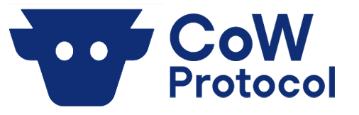

<p align="center">
  
</p>

# CoW SDK

## 📚 [SDK docs website](https://docs.cow.fi/cow-sdk)

## Test coverage

| Statements                                                                                 | Branches                                                                       | Functions                                                                                | Lines                                                                            |
| ------------------------------------------------------------------------------------------ | ------------------------------------------------------------------------------ | ---------------------------------------------------------------------------------------- | -------------------------------------------------------------------------------- |
|  |  |  |  |

## Getting started

**Usage examples: [VanillaJS](./examples/vanilla/src/index.ts), [Create React App](./examples/cra/src/pages/getOrders/index.tsx), [NodeJS](./examples/nodejs/src/index.ts)**

### Installation

```bash
yarn add @cowprotocol/cow-sdk
```

### Content

- `OrderBookApi` - provides the ability to retrieve orders and trades from the CowSap order-book, as well as add and cancel them
- `OrderSigningUtils` - serves to sign orders and cancel them using [EIP-712](https://eips.ethereum.org/EIPS/eip-712)
- `SubgraphApi` - provides statistics data about CoW protocol from [Subgraph](https://github.com/cowprotocol/subgraph), such as trading volume, trades count and others


```typescript
import { OrderBookApi, OrderSigningUtils, SubgraphApi } from '@cowprotocol/cow-sdk'

const chainId = 100 // Gnosis chain

const orderBookApi = new OrderBookApi({ chainId })
const subgraphApi = new SubgraphApi({ chainId })
const orderSigningUtils = new OrderSigningUtils()
```

## Quick start

### Sign, fetch, post and cancel order

For clarity, let's look at the use of the API with a practical example:
Exchanging `0.4 GNO` to `WETH` on `Goerli` network.

We will do the following operations:
1. Get a quote
2. Sign the order
3. Send the order to the order-book
4. Get the data of the created order
5. Get trades of the order
6. Cancel the order (signing + sending)

[You also can check this code in the CRA example](./examples/cra/src/pages/quickStart/index.tsx)


```typescript
import { OrderBookApi } from '@cowprotocol/cow-sdk'
import { Web3Provider } from '@ethersproject/providers'

const account = 'YOUR_WALLET_ADDRESS'
const chainId = 5 // Goerli
const provider = new Web3Provider(window.ethereum)
const signer = provider.getSigner()

const quoteRequest = {
  sellToken: '0xb4fbf271143f4fbf7b91a5ded31805e42b2208d6', // WETH goerli
  buyToken: '0x02abbdbaaa7b1bb64b5c878f7ac17f8dda169532', // GNO goerli
  from: account,
  receiver: account,
  sellAmountBeforeFee: (0.4 * 10 ** 18).toString(), // 0.4 WETH
  kind: OrderQuoteSide.kind.SELL,
}

const orderBookApi = new OrderBookApi()

async function main() {
    const { quote } = await orderBookApi.getQuote(quoteRequest)

    const orderSigningResult = await OrderSigningUtils.signOrder(quote, chainId, signer)

    const orderId = await orderBookApi.sendOrder({ ...quote, ...orderSigningResult })

    const order = await orderBookApi.getOrder(orderId)

    const trades = await orderBookApi.getTrades({ orderId })

    const orderCancellationSigningResult = await OrderSigningUtils.signOrderCancellations([orderId], chainId, signer)

    const cancellationResult = await orderBookApi.sendSignedOrderCancellations({...orderCancellationSigningResult, orderUids: [orderId] })

    console.log('Results: ', { orderId, order, trades, orderCancellationSigningResult, cancellationResult })
}
```
### Querying the Cow Subgraph

The [Subgraph](https://github.com/cowprotocol/subgraph) is constantly indexing the protocol, making all the information more accessible. It provides information about trades, users, tokens and settlements. Additionally, it has some data aggregations which provides insights on the hourly/daily/totals USD volumes, trades, users, etc.

The SDK provides just an easy way to access all this information.

You can query the Cow Subgraph either by running some common queries exposed by the `CowSubgraphApi` or by building your own ones:

```typescript
import { SubgraphApi, SupportedChainId } from '@cowprotocol/cow-sdk'

const subgraphApi = new SubgraphApi({ chainId: SupportedChainId.MAINNET })

// Get CoW Protocol totals
const { tokens, orders, traders, settlements, volumeUsd, volumeEth, feesUsd, feesEth } =
  await csubgraphApi.getTotals()
console.log({ tokens, orders, traders, settlements, volumeUsd, volumeEth, feesUsd, feesEth })

// Get last 24 hours volume in usd
const { hourlyTotals } = await cowSubgraphApi.getLastHoursVolume(24)
console.log(hourlyTotals)

// Get last week volume in usd
const { dailyTotals } = await cowSubgraphApi.getLastDaysVolume(7)
console.log(dailyTotals)

// Get the last 5 batches
const query = `
  query LastBatches($n: Int!) {
    settlements(orderBy: firstTradeTimestamp, orderDirection: desc, first: $n) {
      txHash
      firstTradeTimestamp
    }
  }
`
const variables = { n: 5 }
const response = await cowSubgraphApi.runQuery(query, variables)
console.log(response)
```


## Architecture

One way to make the most out of the SDK is to get familiar to its architecture.

> See [SDK Architecture](./docs/architecture.md)

## Development

### Install Dependencies

```bash
yarn
```

### Build

```bash
yarn build

# Build in watch mode
yarn start
```

### Unit testing

```bash
yarn test
```

### Code generation

Some parets of the SDK are automatically generated. This is the case for the Order Book APU and the Subgraph API

```bash
# Re-create automatically generated code
yarn codegen
```
