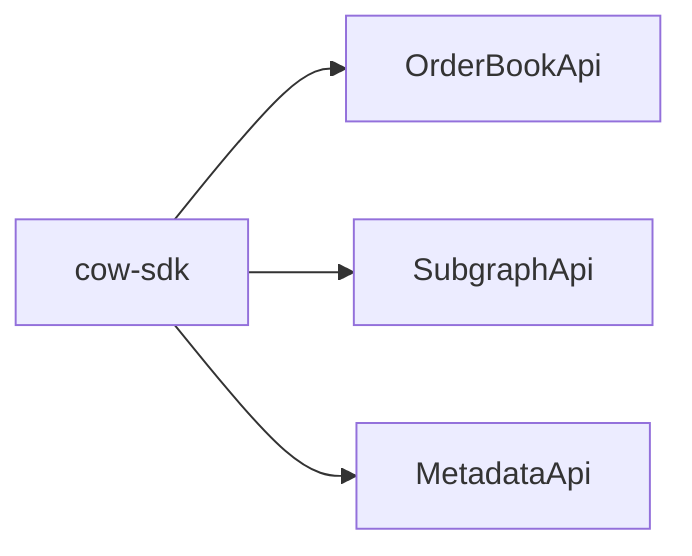
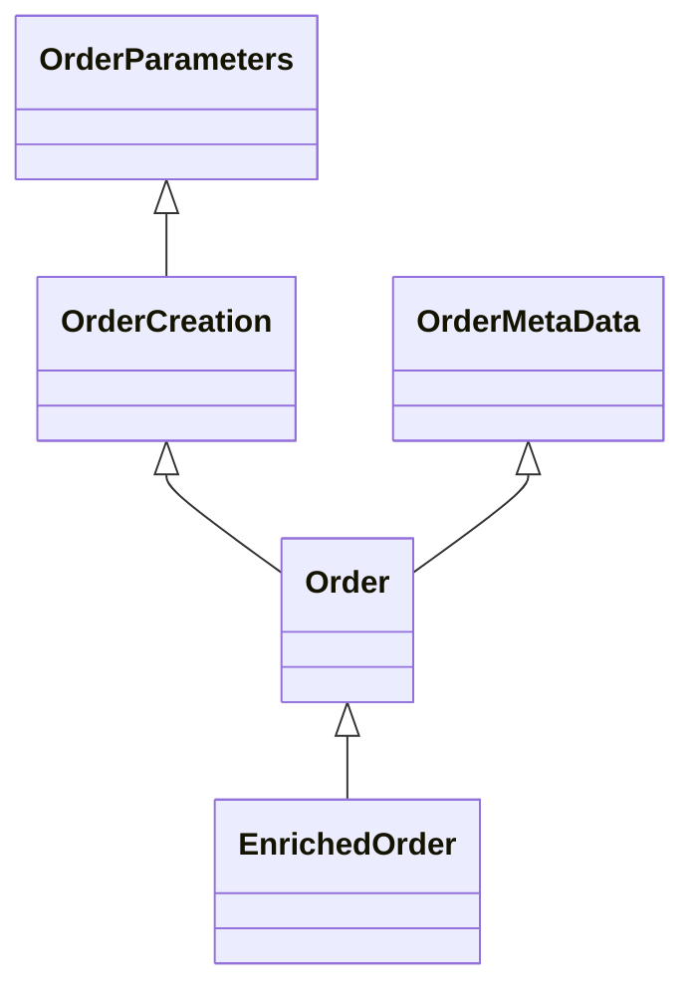
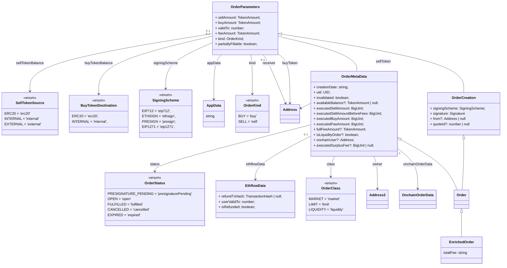
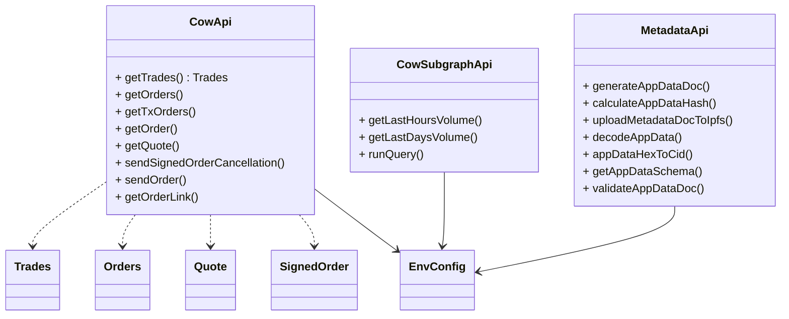
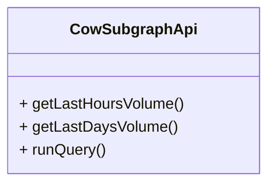
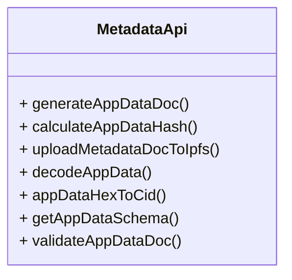

# Architecture

The SDK has 3 main interfaces

- **Order Book API**: Provides access to the OrAPI
  - 📚 [Swagger - Api Docs](https://api.cow.fi/docs)
  - 📚 [Dev Docs - API](https://docs.cow.fi/cow-sdk/cow-api)
- **Subgraph API**: Provides access to On-chain data indexed by The Graph
  - ⚽️ [Playground](https://thegraph.com/hosted-service/subgraph/cowprotocol/cow)
  - 📚 [Dev Docs - SubGraph](https://docs.cow.fi/cow-sdk/querying-the-cow-subgraph)
  - 📄 [Github code](https://github.com/cowprotocol/subgraph)
- **Metadata API**: Allows to encode/decode meta-data to be attached in orders
  - 📚 [Dev Docs - Metadata](https://docs.cow.fi/cow-sdk/order-meta-data-appdata)
  - 📄 [Github code](https://github.com/cowprotocol/app-data)

## Model: Orders

The orders model used for the API is organized in a hierachy

- **OrderParameters\*\***: TODO
- **OrderCreation**: TODO
- **OrderMetaData**: TODO
- **Order**: TODO
- **EnrichedOrder**: TODO

## Model: Orders (details)

## Order Book API

- 📚 [Swagger - Api Docs](https://api.cow.fi/docs)
- 📚 [Dev Docs - API](https://docs.cow.fi/cow-sdk/cow-api)

The API allows to

## API: Subgraph

> ⚽️ [Playground](https://thegraph.com/hosted-service/subgraph/cowprotocol/cow)

> 📚 [Dev Docs - SubGraph](https://docs.cow.fi/cow-sdk/querying-the-cow-subgraph)

> 📄 [Github code](https://github.com/cowprotocol/subgraph)

## API: Meta-data

> 📚 [Dev Docs - Metadata](https://docs.cow.fi/cow-sdk/order-meta-data-appdata)

> 📄 [Github code](https://github.com/cowprotocol/app-data)

