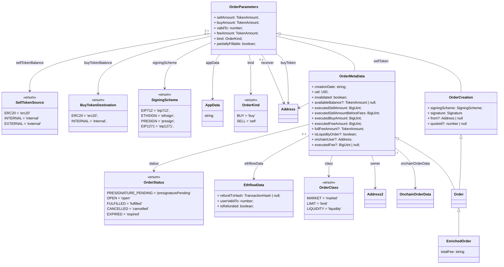

# Architecture

The SDK has 3 main APIs

- **Order Book API**: Allows to get the open orders, historic orders, post new orders, etc.
- **Subgraph API**: Provides access to on-chain data indexed by The Graph
- **Metadata API**: Allows to encode/decode meta-data to be attached in orders

## Model: Orders

The orders model used for the API is organized in a hierarchy:

## Model: Orders (details)

## Model: Trades

## Order Book API

Allows to get the open orders, historic orders, post new orders, etc.

- 📚 [Swagger - Api Docs](https://api.cow.fi/docs)
- 📚 [Dev Docs - API](https://docs.cow.fi/cow-sdk/cow-api)

The API allows to

## API: Subgraph

Provides access to on-chain data indexed by The Graph

> ⚽️ [Playground](https://thegraph.com/hosted-service/subgraph/cowprotocol/cow)

> 📚 [Dev Docs - SubGraph](https://docs.cow.fi/cow-sdk/querying-the-cow-subgraph)

> 📄 [GitHub code](https://github.com/cowprotocol/subgraph)

**NOTE**: For details about the model, it's better to check the schema using the exported Typescript, or by reviewing the [schema definition](https://thegraph.com/hosted-service/subgraph/cowprotocol/cow).

## API: Meta-data

Allows to encode/decode meta-data to be attached in orders

> 📚 [Dev Docs - Metadata](https://docs.cow.fi/cow-sdk/order-meta-data-appdata)

> 📄 [GitHub code](https://github.com/cowprotocol/app-data)

